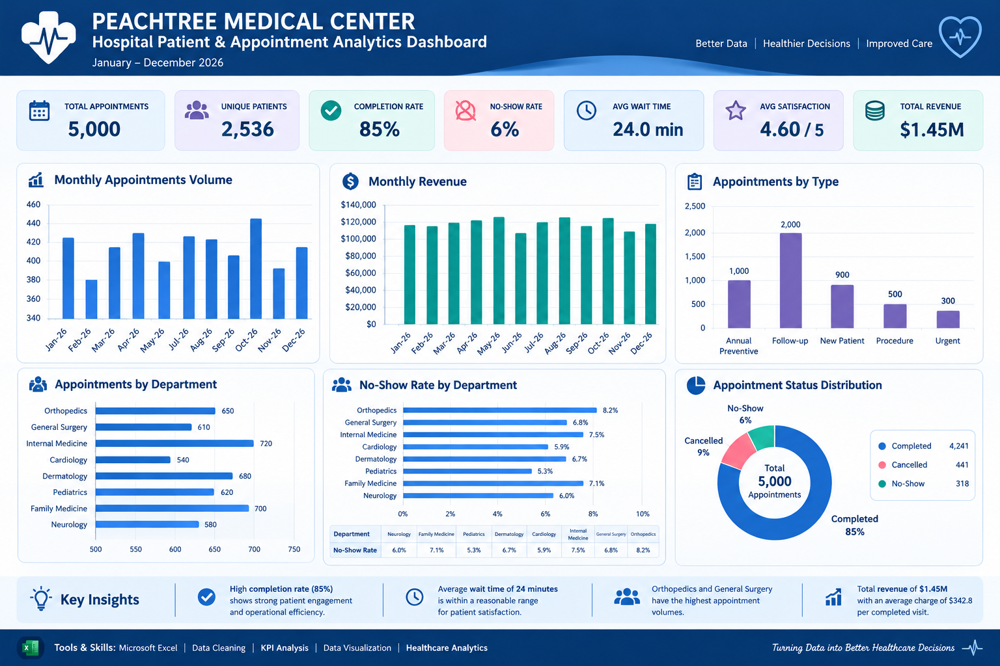

# Hospital Patient & Appointment Analytics

## 📊 Project Overview

This project uses a synthetic healthcare dataset to analyze appointment outcomes, patient activity, department performance, wait times, satisfaction, and revenue.

## 🛠️ Tools

* Microsoft Excel
* Data cleaning and validation
* KPI analysis
* Data visualization

## 📈 Excel Dashboard

## 📁 Project Files

* `Excel/` — Excel dashboard image and workbook.
* `Data/` — Data dictionary, when uploaded.

## 📌 Key Performance Indicators

* Total appointments: 5,000
* Unique patients: 2,536
* Completion rate: 85%
* No-show rate: 6%
* Average wait time: 24 minutes
* Average satisfaction: 4.60/5
* Total revenue: $1.45M

## 📝 Data Note

The dataset is synthetic and intended for educational and portfolio purposes. It does not contain real patient records.

## 🚀 Next Steps

I plan to extend this project by using SQL for deeper analysis and Power BI for interactive visualization.
